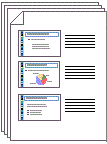

# PDF files manager
> Simple cli script that allow you to merge pdf files or insert pages to take notes.


I wrote this simple script in order to facilitate the process of merging pdf files and creating handouts with lines to take notes.

The handouts option simply insert, between each page of the pdf, one slide similar to the image below.


Then you have to print the pdf with 6 slide per page in order to obtain this result:



## Dependencies
This script is written in Python3 with the help of the [PyPDF2 library](https://github.com/mstamy2/PyPDF2), so make sure to install those components before run it.

OS X instructions using [brew](http://brew.sh/) and [pip](https://pip.pypa.io/en/stable/installing/)
```sh
$ brew install python3
$ pip install PyPDF2 or $ pip3 install PyPDF2
```

## Arguments
This scripts support a variety of arguments in  order to suits your needs.

- `-h, --help`  Show the list of possible arguments
- `-a` Specify the action. "merge" or "notes"
- `-i` Input path. can be a single or multiple pdf file or a directory. (notes accepts only one input file)
- `-o`  Output file. Default: "./output.pdf"
- `--t` Path of the file you want to use as template for taking notes. Default: "./lines.pdf"


## Usage example
```sh
$ python3 pdfScript.py -a merge -i ./pdfDirectory -o ./merged.pdf
```


## Meta

Marco Ravazzini  – marco9446@gmail.com

Distributed under the MIT license. See ``LICENSE`` for more information.

[https://github.com/marco9446](https://github.com/marco9446)
